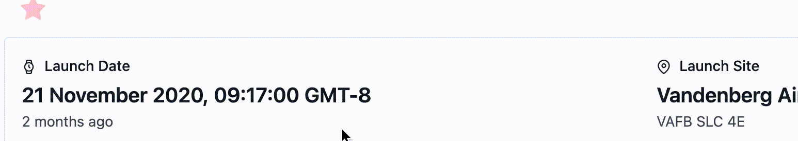
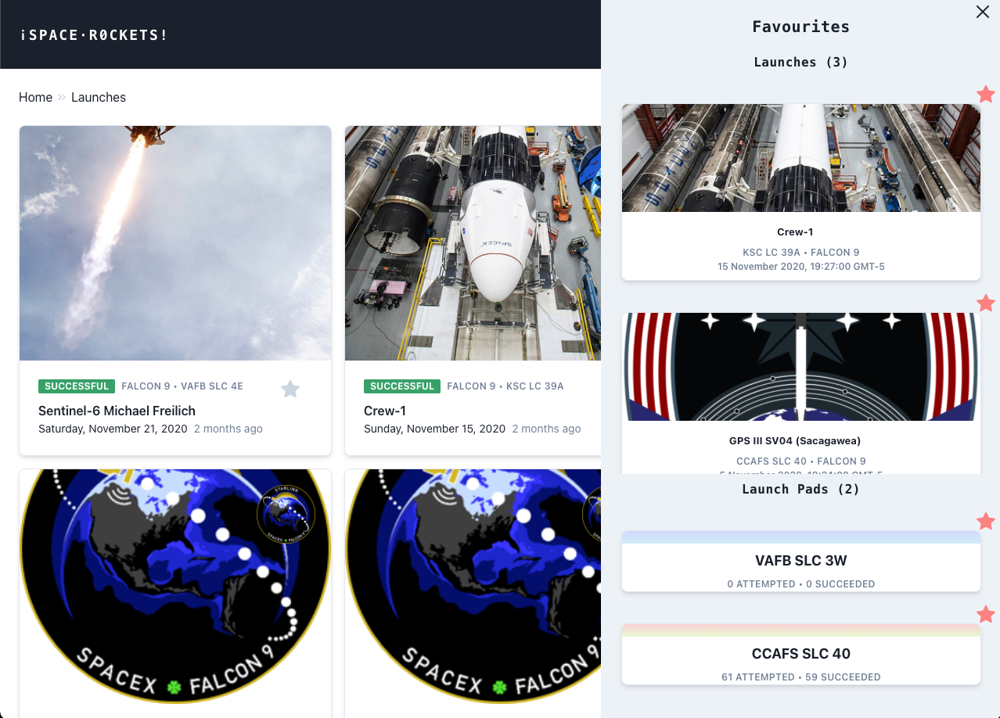

# ¡Space·Rockets!  - Rafał's solution 🧑🏼‍🚀

I made this app as a part of recrutiument journey with Pleo. It allows you to explore SpaceX history, launches and launchapads information.

#### Table of contents

- **[Intro](#hello-people-of-pleo)**
- **[Task 1](#task-1)**
- **[Task 2](#task-2)**
- **[Task 3](#task-3)**
- **[Summary](#summary)**

##### You can explore live app **[here](https://space-rockets-flying-high.netlify.app/)** 🚀

---

**Demo**

Possible improvements: 

- Adding small info icon to indicate that there is a tooltip, not sure tough if that's not too much of a content 🤷🏼

- Adding tests to avoid such bugs in future.

---

**Demo**

Favourites slide-in from right. It is divided in two lists: Launches and Launch Pads. Each of elements can be deleted by clicking the star button. You can easily navigate to your favourite item by clicking the element's card.

Browsing all launches list you can easily recognise which elements are on favourites list. If the start is grey, they are not. 

Same applies to launch pads

From details view you can also recognise if the item is favourite. You can also easily add or remove it from there.

Possible improvements: 

- Favourite launch item and launch pad are very similar, however they are separate components, I'd love to hear on how to improve them to maybe create one component that can be adjusted when needed.

- Positioning of the `ModifyFavouritesButton` on launches can be improved when on different viewport sizes.

- Adding tests 🧪 as here we not only fetch external data but also send information across the entire app  and write and read from browser's local storage.

  

---

**Demo**

User can explore history of SpaceX by traveling along the vertical timeline that shows selected events and its dates. After clicking the title we can see details page with additional information and link to source page with relevant article.

I felt that this application would not be complete without some flying rockets, so I added flying rockets in the background of the timeline page!

Possible improvements:

- Adding more cool animations in the background 🧙🏼‍♂️
- In terms of features there is sea of possibilities here
- Traditionally, it could be improved with tests

