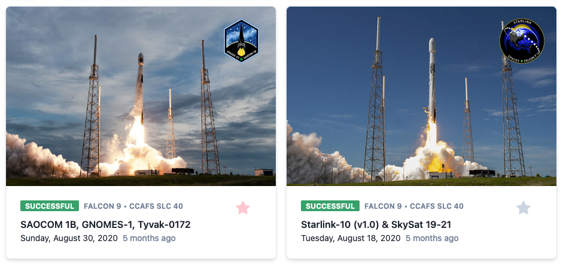
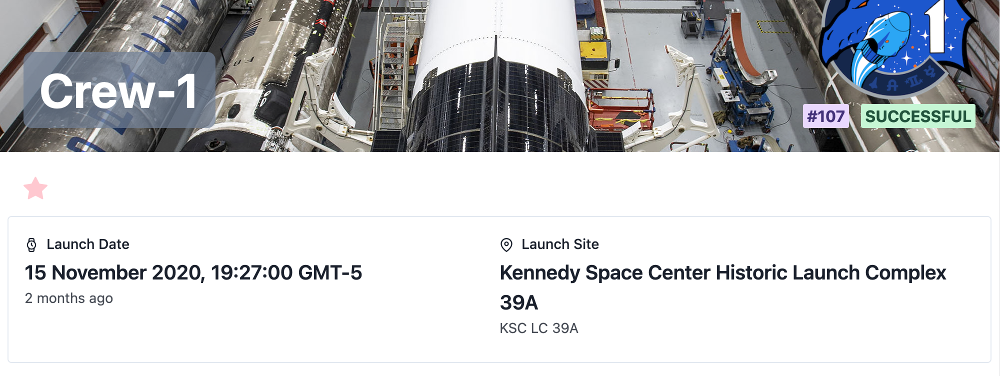

# ¡Space·Rockets!  - Rafał's solution 🧑🏼‍🚀

#### Table of contents

- **[Intro](#hello-people-of-pleo)**
- **[Task 1](#task-1)**
- **[Task 2](#task-2)**
- **[Task 3](#task-3)**
- **[Summary](#summary)**

### Hello people of Pleo!

It was veery exciting challenge. Great combination of fun and work 🥳🧠 Thanks for inviting me to take it! 

Intention of this document is to walk you through my solution, explain my reasoning and hopefully make your life a bit easier by unriddling the GitHub's puzzle I've made with the pull requests. 

Reading further you'll find 3 solutions chapters, one for each challenge.  There I discuss my approach and possible improvements. I also put links to relevant pull requests. At the end of this readme I placed some final remarks.

> *Note on GitHub repo: main branch contains final code and shows just 16 commits, however the commits history is way bigger. Discrepancy is caused by the way I handled merging most of the pull requests (by squashing all the commits in one merge commit). If above is obvious for you, than you probably have way bigger experience than I in managing incoming pull requests - I'm going to catch up in no time 💪🏼* 

##### You can explore live app **[here](https://space-rockets-flying-high.netlify.app/)** 🚀

##### Repository is available **[here](https://github.com/rafwit/-space-rockets)** 📚

I'm excited to hear your what you think about both!

---

### Task 1

I split it into two: fixing a bug and adding tooltip feature. Pull request with bug fixed is [here](https://github.com/rafwit/-space-rockets/pull/1), initial pull request with tooltip is [here](https://github.com/rafwit/-space-rockets/pull/3). After sleeping on it I decided to change the message of the tooltip from "Your time `timestamp`" to "Your timezone `timestamp`". I believe it is more descriptive and can't be misunderstood. Relevant pull request is [here](https://github.com/rafwit/-space-rockets/pull/4).

I fixed the date bug by using property `timeZone` on `Intl.DateTimeFormat` object. I created new function `getTimeZoneNameFromLunchSiteId(id)` that returns launch pad timezone name after receiving its id. This solution creates a date with offset to GMT. That allowed to adjust dates not only on the Launch component but also on the Launches component. Just before submitting the solution I discovered that Firefox doesn't recognise timezone name PST, hence I had to change it to "America/Los_Angeles". [Here](https://github.com/rafwit/-space-rockets/pull/10) you can find relevant pull request. 

I would love to hear about more scale proof solution to this, as if the SpaceX add new launch pads it would require to update `getTimeZoneNameFromLunchSiteId(id)`function to include it. 

**Demo**

Possible improvements: 

- Adding small info icon to indicate that there is a tooltip, not sure tough if that's not too much of a content 🤷🏼

- Adding tests to avoid such bugs in future.

  

---

### Task 2

Initially I started to built the favourites with Chakra UI Drawer component, however I wanted to have more control over how the element behaves and finally went for building it with other Chakra components and inline CSS (I'd love to learn more on how to manipulate behaviour of that template tough!).

For this task I decided to use Redux, because it gave me superpower of adding to favourite in one place and being able to read it in any other place across the application. Like a ninja 🥷🏼 I've choose it over Context, because I have experience working with Redux and I felt more comfortable using it. 

First pull request with feature is [here](https://github.com/rafwit/-space-rockets/pull/5). While working on [Task 3](#task-3) I fixed some bugs and added media queries to handle viewport change. Relevant pull request [here](https://github.com/rafwit/-space-rockets/pull/12)

Modifying favourites is controller by `ModifyFavouritesButton` component which I reuse across all the views. In addition, app gives feedback on actions on favourites. For example, if you try to delete launch from favourites while in Launches component, you'll see toast popping-up with hint on next steps.

Persisting the favourites list is achieved by saving the data to user browser's local storage. 

**Demo**

Favourites slide-in from right. It is divided in two lists: Launches and Launch Pads. Each of elements can be deleted by clicking the star button. You can easily navigate to your favourite item by clicking the element's card.

Browsing all launches list you can easily recognise which elements are on favourites list. If the start is grey, they are not. 

Same applies to launch pads

From details view you can also recognise if the item is favourite. You can also easily add or remove it from there.

Possible improvements: 

- Favourite launch item and launch pad are very similar, however they are separate components, I'd love to hear on how to improve them to maybe create one component that can be adjusted when needed.

- Positioning of the `ModifyFavouritesButton` on launches can be improved when on different viewport sizes.

- Adding tests 🧪 as here we not only fetch external data but also send information across the entire app  and write and read from browser's local storage.

  

---

### Task 3

For this challenge I decided to explore the SpaceX API and further develop features of ¡Space·Rockets! I used data provided by `/history` endpoint and created a Timeline component. Relevant pull request [here](https://github.com/rafwit/-space-rockets/pull/9). Along the way I fixed some some things and you can find relevant pull request [here](https://github.com/rafwit/-space-rockets/pull/12)

I decided to build this component using Chakra UI elements. In addition I used styled components to create animation.

**Demo**

User can explore history of SpaceX by traveling along the vertical timeline that shows selected events and its dates. After clicking the title we can see details page with additional information and link to source page with relevant article.

I felt that this application would not be complete without some flying rockets, so I added flying rockets in the background of the timeline page!

Possible improvements:

- Adding more cool animations in the background 🧙🏼‍♂️
- In terms of features there is sea of possibilities here
- Traditionally, it could be improved with tests

---

### Summary

I enjoyed this challenge and tried to showcase my best skills in terms of translating expectations into reality, writing a clean code, structuring and designing the solution. I put my best skill into that. 

If one of the project goals was to give me feeling of what would day-to-day look like, than I'm even more excited then before starting it!  I think that, among others, there is a room for improvement when it comes to managing incoming pull requests 🙊 I would also like to hear your feedback on other parts of my solution.

I hope that you find the project cool and worth talking to me in the next stage.

Best!

